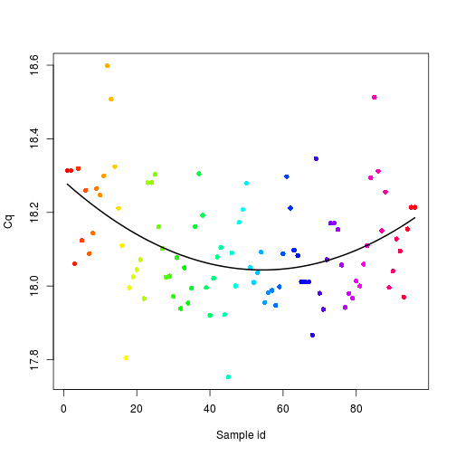
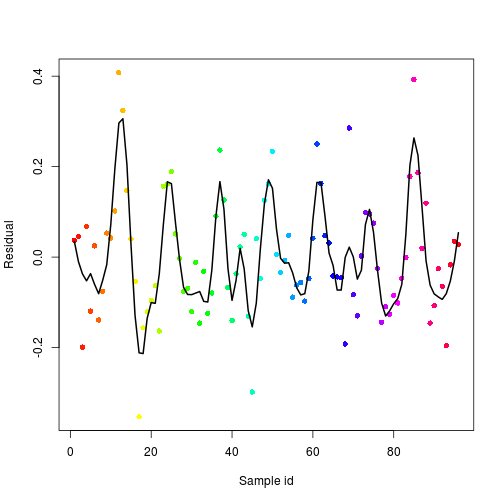
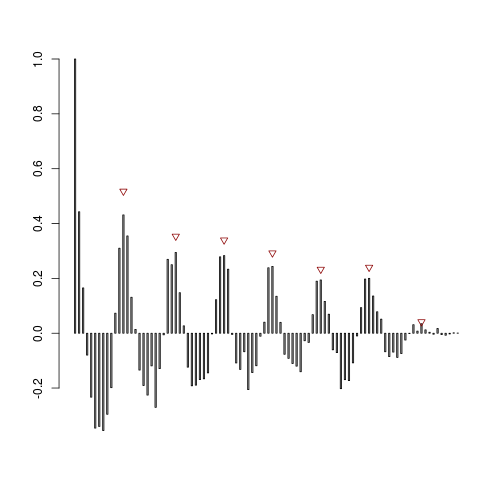
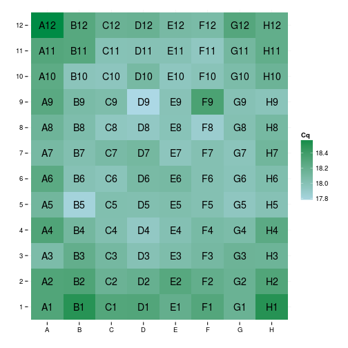

# Periodicity report

Report generated on 2015-07-07 11:51:24 using [period_app](https://michbur.shinyapps.io/period_app).

## Data with fitted quadratic model

 

Linear model coefficient: 3.47 &times; 10-5.  

Quadratic model coefficient: 1.24 &times; 10-4.  

## Residuals of the model

 

Local polynomial regression fit standard error: 0.0921.

Runs test p-value: 2.21 &times; 10-4.  

Ljung-Box test p-value: 1.05 &times; 10-5.

## Putative periodicity

 

Estimated periodicity: 12.3 ± 0.5

## Input data

 

